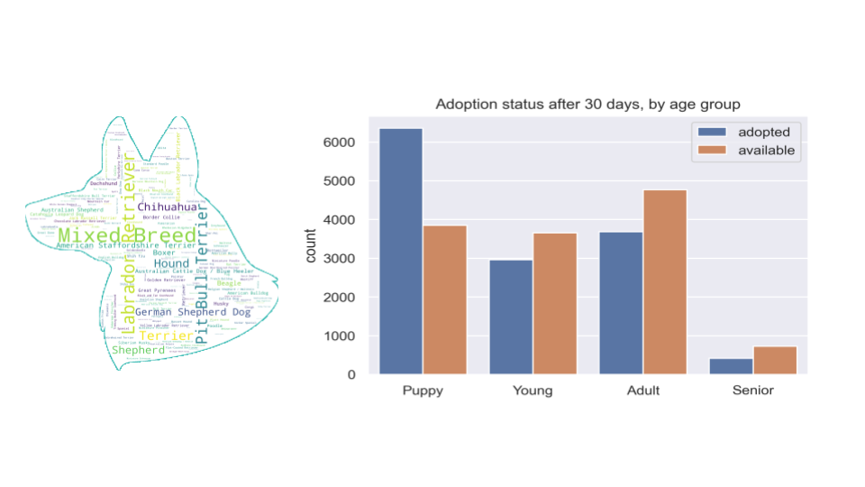
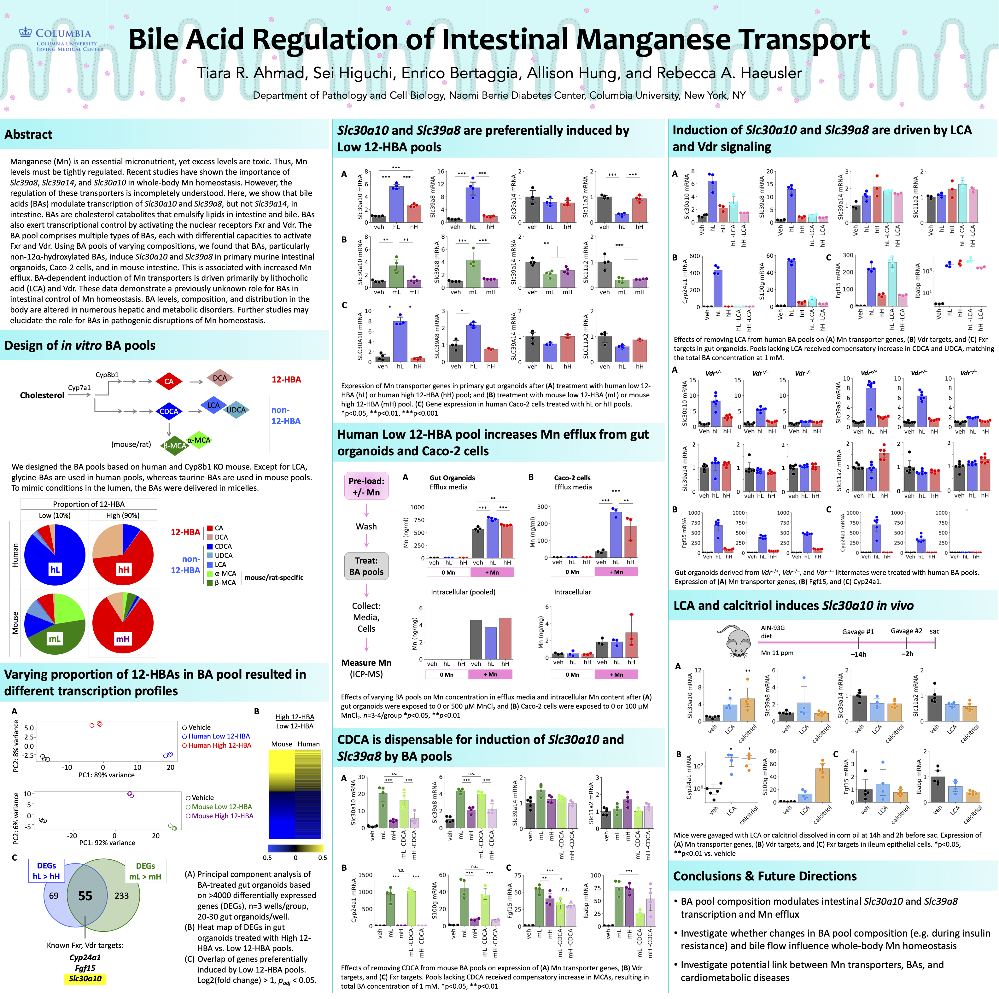

### Hello! 

I'm a data scientist interested in making the world a healthier, happier place. I conducted my doctoral work in the [Haeusler Lab](http://www.rhaeuslerlab.com/) at Columbia University's Naomi Berrie Diabetes Center and completed a data science bootcamp with [The Data Incubator](https://www.thedataincubator.com/). 

---

### Data Science Projects 

**Paws and Tales (2023)**

Capstone project for The Data Incubator. Deployed a machine learning model in an interactive app to predict whether a dog within 100 miles of New York City will be adopted within one month of posting on Petfinder. Built model using random forest classifier trained on quantitative and qualitative data of 20,000+ dogs. 

[Streamlit app](https://pawsandtales.streamlit.app/) 

[GitHub repo](https://github.com/chonkcheto/adoptabledogsofny)

 

---
**RNA sequencing of mini intestines under diabetic-like conditions (2017-2020)**

Core component of doctoral research. Conducted bulk RNA sequencing to identify differentially expressed genes in mini intestines exposed to different environments. Validated target genes with independent batches of mini intestines, qPCR, and functional assays. Presented at Gordon Research Conference Cell Biology of Metals 2019 and published work in the Journal of Biological Chemistry. [Peer-reviewed article](https://www.jbc.org/article/S0021-9258(17)49493-2/fulltext)

 

---

### Publications 

Higuchi S, **Ahmad TR**, Argueta DA, Perez PA, Zhao C, Schwartz GJ, DiPatrizio NV, Haeusler RA. Bile acid composition regulates GPR119-dependent intestinal lipid sensing and food intake regulation in mice. _Gut_ 69: 1620-1628 (2020). [Link](https://gut.bmj.com/content/69/9/1620.long)

**Ahmad TR**, Higuchi S, Bertaggia E, Hung A, Shanmugarajah N, Guilz NC, Gamarra JR, Haeusler RA. Bile acid composition regulates the manganese transporter Slc30a10 in intestine. _Journal of Biological Chemistry_ 295: 12545-12558 (2020) [Link](https://www.jbc.org/article/S0021-9258(17)49493-2/fulltext)
- Awarded Journal of Biological Chemistry Editors' Pick (top 2% of articles published yearly)

**Ahmad TR**, Haeusler RA. Bile acids in glucose metabolism and insulin signalling — mechanisms and research needs. _Nature Reviews Endocrinology_ 15: 701-712 (2019). [Link](https://www.nature.com/articles/s41574-019-0266-7)

More on [Google Scholar](https://scholar.google.com/citations?hl=en&user=4reAnikAAAAJ&view_op=list_works&sortby=pubdate)

--- 

### Professional affiliations 

- [American Association for the Advancement of Science (AAAS)](https://www.aaas.org/)
- [National Science Policy Network (NSPN)](https://www.scipolnetwork.org/)
- [Women in Data](https://www.womenindata.org/)

---

Page template forked from <a href="https://github.com/evanca/quick-portfolio">evanca</a>

<!-- Remove above link if you don't want to attibute -->
